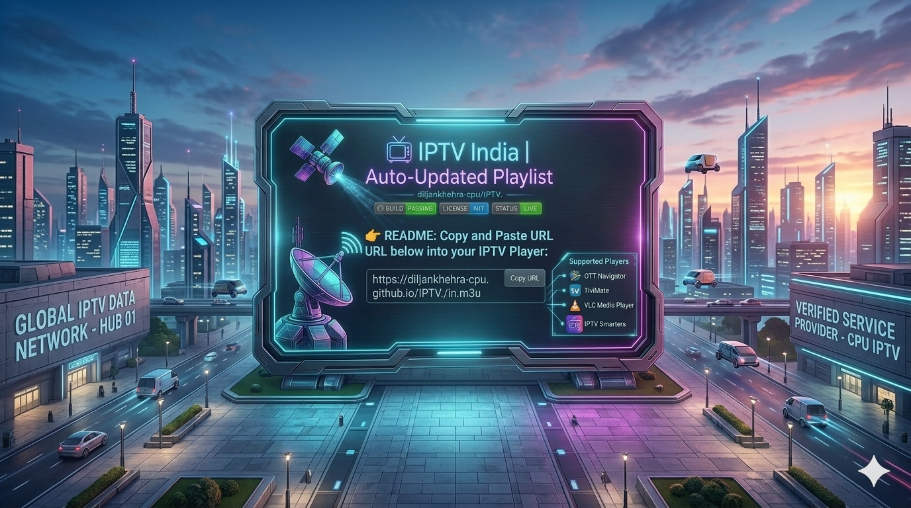

# 📺 IPTV India | Auto-Updated Playlist

---

### 🚀 Smart IPTV Gateway
An advanced automated system that aggregates live Indian television channels in real-time into a seamless, high-performance M3U playlist.

---

### 🔗 Quick Access Link
**Copy this URL and paste it into your favorite IPTV player:**

> `https://diljankhehra-cpu.github.io/IPTV./in.m3u`

---

### 🛠 Supported Players
*Optimized for high-performance streaming applications:*

| Player | Platform |
| :--- | :--- |
| **TiviMate** | Android TV |
| **OTT Navigator** | Android |
| **VLC Media Player** | Cross-Platform |
| **IPTV Smarters** | All Devices |

---
---

### 📋 How to use? (Setup Guide)
ਤੁਸੀਂ ਸਿਰਫ 3 ਸਟੈਪਸ ਵਿੱਚ ਸਾਰੇ ਚੈਨਲ ਦੇਖ ਸਕਦੇ ਹੋ:

1. **Copy the Link:** 
   `https://diljankhehra-cpu.github.io/IPTV./in.m3u`
   
2. **Choose Your Player:** 
   ਆਪਣੀ ਡਿਵਾਈਸ 'ਤੇ TiviMate, OTT Navigator, ਜਾਂ IPTV Smarters ਡਾਊਨਲੋਡ ਕਰੋ।

3. **Add Playlist:** 
   Player ਖੋਲ੍ਹੋ -> **"Add M3U Playlist"** ਚੁਣੋ -> ਉੱਪਰ ਦਿੱਤਾ ਲਿੰਕ ਪੇਸਟ ਕਰੋ -> **"Load"** ਬਟਨ ਦਬਾਓ।

*ਹੁਣ ਤੁਹਾਡੇ ਸਾਰੇ ਚੈਨਲ ਲਾਈਵ ਚੱਲਣ ਲਈ ਤਿਆਰ ਹਨ!*

---

### ⚙️ Technical Architecture
* **Python Automation:** A robust script that parses and validates stream links every 60 minutes.
* **GitHub Actions:** Fully decentralized, automated CI/CD pipeline ensuring 99.9% uptime.
* **Zero Latency:** Stream data is served directly via GitHub's global edge network for instant buffering.

---

### 💡 Contribution & Support
Have an idea or a channel request? 
**[Open an Issue](https://github.com/diljankhehra-cpu/IPTV./issues) | [Submit a Pull Request](https://github.com/diljankhehra-cpu/IPTV./pulls)**

---

*Built with precision for Indian viewers | Auto-Update Cycle: 60 Minutes*

